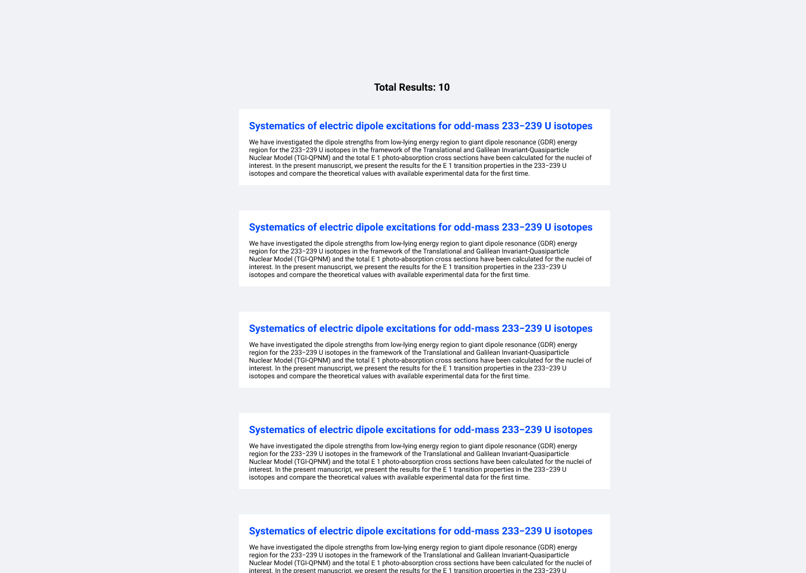
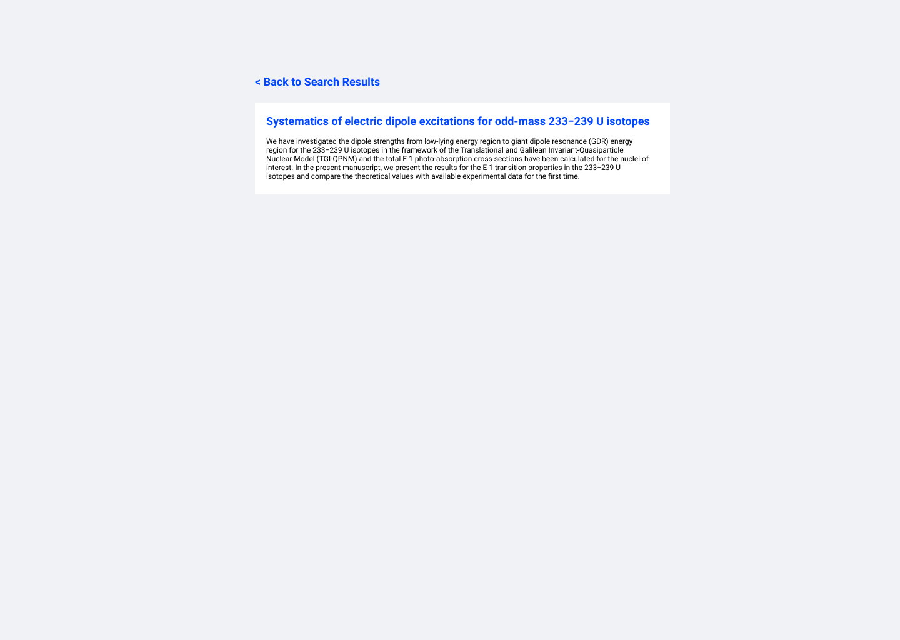

# Instructions

We're building the new UI of Inspire. Your task is to create the awesome search [ListItemView](https://github.com/inspirehep/inspire-exercise#listitemview) and detail [ItemView](https://github.com/inspirehep/inspire-exercise#itemview) pages using the Inspire REST API.

Please fork this repository, we have already setup a React application for you :smile:

The exercise is to develop the pages mentioned above and commit your work step-by-step with clear messages. You could use any library that you think is useful for this task. When you are ready, please email us back with the link of your fork.

**You should not spend more than 1 hour in this exercise!**

<p align="center">
:tada: Good Luck and Happy Coding! :tada:
</p>

## ListItemView
Using the INSPIRE REST API, create a view with a list of records. The UI should be simple and display the main info from the API response (first title and abstract). Clicking on the title displays the [ItemView](#ItemView) for the selected record. Mockup:



API endpoint:
<details>
  <summary>GET https://inspirehep.net/api/literature</summary>

```json
{
  "hits": {
    "hits": [
      {
        "updated": "2021-02-05T17:12:44.185421+00:00",
        "metadata": {
          "citation_count": 0,
          "citation_count_without_self_citations": 0,
          "abstracts": [
            {
              "abstract_source_suggest": {
                "input": "Elsevier"
              },
              "value": "We have investigated the dipole strengths from low-lying energy region to giant dipole resonance (GDR) energy region for the 233−239 U isotopes in the framework of the Translational and Galilean Invariant-Quasiparticle Nuclear Model (TGI-QPNM) and the total E 1 photo-absorption cross sections have been calculated for the nuclei of interest. In the present manuscript, we present the results for the E 1 transition properties in the 233−239 U isotopes and compare the theoretical values with available experimental data for the first time.",
              "source": "Elsevier"
            }
          ],
          "authors": [
            {
              "affiliations": [
                {
                  "value": "Sakarya U.",
                  "record": {
                    "$ref": "https://inspirehep.net/api/institutions/909752"
                  }
                }
              ],
              "name_suggest": {
                "input": [
                  "e. tabar",
                  "e tabar",
                  "e., tabar",
                  "e, tabar",
                  "tabar, e",
                  "tabar e.",
                  "tabar, e.",
                  "tabar",
                  "tabar e"
                ]
              },
              "signature_block": "TABARe",
              "last_name": "Tabar",
              "first_name": "E.",
              "uuid": "68cbb56b-552e-4ae3-9408-4bc906beb03b",
              "full_name_unicode_normalized": "tabar, e.",
              "raw_affiliations": [
                {
                  "value": "Department of Physics, Faculty of Science and Art, Sakarya University, Sakarya, Turkey"
                }
              ],
              "bai": "E.Tabar.1",
              "ids": [
                {
                  "value": "E.Tabar.1",
                  "schema": "INSPIRE BAI"
                }
              ],
              "full_name": "Tabar, E."
            },
            {
              "affiliations": [
                {
                  "value": "Sakarya U.",
                  "record": {
                    "$ref": "https://inspirehep.net/api/institutions/909752"
                  }
                }
              ],
              "name_suggest": {
                "input": [
                  "yakut, h.",
                  "h., yakut",
                  "yakut",
                  "yakut h",
                  "h yakut",
                  "h, yakut",
                  "yakut h.",
                  "h. yakut",
                  "yakut, h"
                ]
              },
              "signature_block": "YACATh",
              "last_name": "Yakut",
              "first_name": "H.",
              "uuid": "ec189277-6e7a-4789-aa7a-04d42b875c57",
              "full_name_unicode_normalized": "yakut, h.",
              "raw_affiliations": [
                {
                  "value": "Department of Physics, Faculty of Science and Art, Sakarya University, Sakarya, Turkey"
                }
              ],
              "bai": "H.Yakut.2",
              "ids": [
                {
                  "value": "H.Yakut.2",
                  "schema": "INSPIRE BAI"
                }
              ],
              "full_name": "Yakut, H."
            },
            {
              "affiliations": [
                {
                  "value": "Sakarya U.",
                  "record": {
                    "$ref": "https://inspirehep.net/api/institutions/909752"
                  }
                }
              ],
              "name_suggest": {
                "input": [
                  "kemah e",
                  "kemah, e.",
                  "e kemah",
                  "e. kemah",
                  "kemah, e",
                  "kemah",
                  "e., kemah",
                  "kemah e.",
                  "e, kemah"
                ]
              },
              "signature_block": "CANe",
              "last_name": "Kemah",
              "first_name": "E.",
              "uuid": "d08ad7d1-97ae-4797-b122-6bda96a0290e",
              "full_name_unicode_normalized": "kemah, e.",
              "raw_affiliations": [
                {
                  "value": "Department of Physics, Faculty of Science and Art, Sakarya University, Sakarya, Turkey"
                }
              ],
              "bai": "E.Kemah.1",
              "ids": [
                {
                  "value": "E.Kemah.1",
                  "schema": "INSPIRE BAI"
                }
              ],
              "full_name": "Kemah, E.",
              "emails": [
                "elifkemah90@gmail.com"
              ]
            },
            {
              "affiliations": [
                {
                  "value": "Sakarya U.",
                  "record": {
                    "$ref": "https://inspirehep.net/api/institutions/909752"
                  }
                }
              ],
              "name_suggest": {
                "input": [
                  "n., demirci saygi",
                  "n., demirci",
                  "n demirci",
                  "saygi, n.",
                  "saygi",
                  "n demirci saygi",
                  "n. saygi",
                  "demirci saygi, n",
                  "n., saygi",
                  "n, saygi",
                  "n, demirci saygi",
                  "n, demirci",
                  "n saygi",
                  "demirci saygi n.",
                  "saygi, n",
                  "demirci n.",
                  "saygi n.",
                  "demirci",
                  "demirci saygi, n.",
                  "demirci n",
                  "n. demirci",
                  "n. demirci saygi",
                  "demirci saygi",
                  "demirci, n.",
                  "demirci, n",
                  "demirci saygi n",
                  "saygi n"
                ]
              },
              "signature_block": "SYGn",
              "last_name": "Demirci Saygı",
              "first_name": "N.",
              "uuid": "c239b6fb-cff5-4ca4-b695-832506b0622e",
              "full_name_unicode_normalized": "demirci saygı, n.",
              "raw_affiliations": [
                {
                  "value": "Department of Physics, Faculty of Science and Art, Sakarya University, Sakarya, Turkey"
                }
              ],
              "bai": "N.Demirci.Saygi.2",
              "ids": [
                {
                  "value": "N.Demirci.Saygi.2",
                  "schema": "INSPIRE BAI"
                }
              ],
              "full_name": "Demirci Saygı, N."
            },
            {
              "affiliations": [
                {
                  "value": "Sakarya U.",
                  "record": {
                    "$ref": "https://inspirehep.net/api/institutions/909752"
                  }
                }
              ],
              "name_suggest": {
                "input": [
                  "g, hosgor",
                  "g., hosgor",
                  "g. hosgor",
                  "hosgor",
                  "hosgor g.",
                  "hosgor g",
                  "g hosgor",
                  "hosgor, g.",
                  "hosgor, g"
                ]
              },
              "signature_block": "HASGARg",
              "last_name": "Hoşgör",
              "first_name": "G.",
              "uuid": "de1e1005-6eaf-492d-a6f2-6293935cb736",
              "full_name_unicode_normalized": "hoşgör, g.",
              "raw_affiliations": [
                {
                  "value": "Department of Physics, Faculty of Science and Art, Sakarya University, Sakarya, Turkey"
                }
              ],
              "bai": "G.Hosgoer.2",
              "ids": [
                {
                  "value": "G.Hosgoer.2",
                  "schema": "INSPIRE BAI"
                }
              ],
              "full_name": "Hoşgör, G."
            },
            {
              "affiliations": [
                {
                  "value": "Sakarya U.",
                  "record": {
                    "$ref": "https://inspirehep.net/api/institutions/909752"
                  }
                }
              ],
              "name_suggest": {
                "input": [
                  "quliyev, h.",
                  "h. quliyev",
                  "quliyev",
                  "h quliyev",
                  "quliyev, h",
                  "quliyev h.",
                  "h., quliyev",
                  "h, quliyev",
                  "quliyev h"
                ]
              },
              "signature_block": "QALYAFh",
              "last_name": "Quliyev",
              "first_name": "H.",
              "uuid": "83f2435f-cd70-42e4-b521-e7319c64548b",
              "full_name_unicode_normalized": "quliyev, h.",
              "raw_affiliations": [
                {
                  "value": "Department of Physics, Faculty of Science and Art, Sakarya University, Sakarya, Turkey"
                }
              ],
              "bai": "H.Quliyev.2",
              "ids": [
                {
                  "value": "0000-0002-6306-658X",
                  "schema": "ORCID"
                },
                {
                  "value": "H.Quliyev.2",
                  "schema": "INSPIRE BAI"
                }
              ],
              "full_name": "Quliyev, H."
            },
            {
              "affiliations": [
                {
                  "value": "Baku, Inst. Phys.",
                  "record": {
                    "$ref": "https://inspirehep.net/api/institutions/902656"
                  }
                }
              ],
              "name_suggest": {
                "input": [
                  "kuliev, a.a.",
                  "a.a. kuliev",
                  "kuliev",
                  "kuliev, a",
                  "kuliev a.a.",
                  "kuliev a",
                  "a kuliev",
                  "a, kuliev",
                  "a.a., kuliev"
                ]
              },
              "signature_block": "CALAFa",
              "last_name": "Kuliev",
              "first_name": "A.A.",
              "uuid": "beaa4efa-aa7c-4204-bf12-d65b0b38b396",
              "full_name_unicode_normalized": "kuliev, a.a.",
              "raw_affiliations": [
                {
                  "value": "The National Aviation Academy of Azerbaijan, Baku, Azerbaijan"
                }
              ],
              "bai": "A.A.Kuliev.1",
              "ids": [
                {
                  "value": "A.A.Kuliev.1",
                  "schema": "INSPIRE BAI"
                }
              ],
              "full_name": "Kuliev, A.A."
            }
          ],
          "referenced_authors_bais": [
            "A.A.Klimenko.1",
            "A.A.Kuliev.1",
            "A.A.Kuliev.2",
            "A.Bracco.1",
            "A.Bulgac.1",
            "A.Chatillon.1",
            "A.Degener.1",
            "A.Faessler.1",
            "A.Gorgen.1",
            "A.Hennig.1",
            "A.Jung.1",
            "A.Kelic.Heil.2",
            "A.Klimkiewicz.1",
            "A.K.Movsesyan.1",
            "A.Krugmann.1",
            "A.Kuliev.2",
            "A.Lepretre.1",
            "A.M.Khan.2",
            "A.M.Krumbholz.1",
            "Andreas.Wagner.1",
            "Ann-Cecilie.Larsen.1",
            "A.Pagano.1",
            "A.P.Tonchev.1",
            "A.P.Wagner.1",
            "A.Richter.2",
            "A.R.Junghans.1",
            "A.S.Adekola.1",
            "A.Tamii.1",
            "A.Tamii.3",
            "A.Trifiro.4",
            "A.Trkov.1",
            "A.Veyssiere.1",
            "A.Vitturi.1",
            "A.Zilges.1",
            "B.A.Tulupov.1",
            "B.Fernandez.Dominguez.1",
            "B.Gnoffo.1",
            "B.Jurado.1",
            "B.K.Agrawal.2",
            "B.L.Berman.1",
            "B.Leniau.1",
            "B.Ozel.Tashenov.1",
            "B.Rubio.1",
            "B.V.Carlson.2",
            "C.A.Bertulani.1",
            "C.C.Martin.1",
            "C.De.Coster.1",
            "C.Hicks.1",
            "C.Iwamoto.1",
            "C.Maiolino.2",
            "C.Nociforo.1",
            "C.R.Howell.1",
            "C.Romig.1",
            "C.Stoyanov.1",
            "C.T.Angell.1",
            "C.Wesselborg.1",
            "C.Wilson.1",
            "C.W.Johnson.1",
            "C.W.Nestor.1",
            "D.Bemmerer.1",
            "D.Bohle.1",
            "D.Cortina.Gil.1",
            "D.D.Aquila.1",
            "D.Ishikawa.1",
            "D.K.Shuh.1",
            "D.P.McNabb.1",
            "D.Rossi.1",
            "D.Santonocito.1",
            "D.Savran.1",
            "D.Vautherin.2",
            "D.Vretenar.1",
            "D.Zawischa.1",
            "E.B.Norman.1",
            "E.Casarejos.1",
            "E.De.Filippo.1",
            "E.Ganioglu.1",
            "E.G.Lanza.3",
            "E.Guliyev.1",
            "Eiji.Ideguchi.1",
            "E.J.Dowdy.1",
            "E.Kemah.1",
            "E.Khan.1",
            "E.Kwan.1",
            "E.Swanberg.1",
            "E.Tabar.1",
            "E.Tabar.2",
            "E.V.Litvinova.1",
            "E.V.Pagano.3",
            "F.Aksouh.1",
            "F.Catara.1",
            "F.Donau.1",
            "F.D.Smit.1",
            "F.Ertugral.1",
            "F.Ertugral.Yamac.1",
            "F.Giacoppo.1",
            "F.Gunsing.1",
            "F.Palumbo.1",
            "F.Rizzo.1",
            "G.A.Bartholomew.1",
            "G.Cardella.1",
            "G.Colo.2",
            "G.Hosgoer.2",
            "G.Kilgus.1",
            "G.Lanzalone.2",
            "G.M.Gurevich.1",
            "G.M.Tveten.1",
            "G.Politi.1",
            "G.Rusev.2",
            "G.Suesoy.1",
            "G.V.Solodukhov.1",
            "G.Warren.1",
            "H.Alvarez.Pol.1",
            "H.Beil.1",
            "H.Emling.1",
            "H.Friedrichs.1",
            "H.Fujita.2",
            "H.Geissel.1",
            "H.H.Pitz.1",
            "Hiroyuki.Okamura.1",
            "H.J.Karwowski.1",
            "H.J.Ong.1",
            "H.Lenske.1",
            "H.Maser.1",
            "H.Matsubara.1",
            "H.Quliyev.2",
            "H.Sakaguchi.1",
            "H.Schacht.1",
            "H.Scheit.1",
            "H.Simon.2",
            "H.T.Johansson.2",
            "H.Weick.1",
            "H.Yakut.1",
            "H.Yakut.2",
            "I.Lombardo.1",
            "I.Poltoratska.1",
            "I.Stetcu.1",
            "J.A.Caggiano.1",
            "J.Benlliure.1",
            "J.D.Wilson.1",
            "J.Enders.1",
            "J.H.Kelley.2",
            "J.H.Thies.1",
            "J.Knowles.1",
            "J.Margraf.1",
            "J.Piekarewicz.1",
            "J.R.Carter.1",
            "J.Simonis.1",
            "J.Speth.2",
            "J.T.Caldwell.1",
            "J.V.Kratz.1",
            "J.Wambach.1",
            "J.Zenihiro.1",
            "K.Boretzky.1",
            "K.D.Hummel.1",
            "Kenichi.Yoshida.1",
            "K.Fujita.3",
            "K.Heyde.1",
            "Kichiji.Hatanaka.1",
            "K.J.Roche.1",
            "K.Kernbath.1",
            "K.Mahata.1",
            "K.Miki.2",
            "Kohsuke.Nakanishi.1",
            "K.Schilling.1",
            "K.S.Mmerer.1",
            "K.Sonnabend.1",
            "L.A.Bernstein.1",
            "L.Acosta.1",
            "L.Auditore.4",
            "L.C.Biedenharn.1",
            "L.E.Lazareva.1",
            "L.Quattrocchi.1",
            "L.T.Phuc.1",
            "M.Aiche.1",
            "M.A.Papa.1",
            "Masanori.Dozono.1",
            "M.Boehmer.1",
            "M.Centelles.1",
            "M.Chartier.1",
            "M.Danos.1",
            "M.Dingfelder.1",
            "M.Fritzsche.1",
            "M.Gorska.1",
            "M.Guttormsen.1",
            "M.Heil.2",
            "M.Itoh.3",
            "M.Johnson.1",
            "M.Kortelainen.1",
            "M.Labiche.1",
            "M.Lebois.1",
            "M.Marta.1",
            "M.R.Anders.1",
            "M.Samyn.1",
            "M.Sin.4",
            "M.Spieker.1",
            "M.Trimarchi.2",
            "M.V.Andres.1",
            "M.Vigilante.1",
            "M.W.Herman.1",
            "M.Wiedeking.1",
            "M.Winkler.4",
            "M.Yosoi.1",
            "N.Aoi.1",
            "N.Auerbach.2",
            "N.Demirci.Saygi.1",
            "N.Dinh.Dang.1",
            "N.Hinohara.1",
            "N.Kurz.1",
            "N.Lo.Iudice.1",
            "N.Paar.1",
            "N.Pietralla.1",
            "N.S.Martorana.2",
            "N.T.Khai.1",
            "N.Tsoneva.1",
            "N.Van.Giai.1",
            "O.Bohigas.1",
            "O.D.Ershova.1",
            "O.Kiselev.1",
            "O.Yevetska.1",
            "P.Adrich.1",
            "P.Carlos.1",
            "Pertti.O.Tikkanen.1",
            "P.Glans.1",
            "P.G.Reinhard.1",
            "P.Magierski.1",
            "P.Maierbeck.1",
            "P.Meyer.2",
            "P.P.Arteaga.1",
            "P.Ring.1",
            "P.Russotto.1",
            "P.von.Brentano.1",
            "P.von.Neumann.Cosel.1",
            "Q.Ducasse.1",
            "Q.Q.Hung.1",
            "R.A.Alvarez.1",
            "R.Bergere.1",
            "R.Capote.2",
            "R.Copping.1",
            "R.D.Heil.1",
            "R.D.Herzberg.1",
            "R.Hannaske.1",
            "R.J.Ledoux.1",
            "R.Kr.Cken.1",
            "R.Massarczyk.1",
            "R.Mohan.2",
            "R.Neveling.1",
            "R.Nojarov.1",
            "Roland.Beyer.1",
            "Roy.C.Lemmon.1",
            "R.Palit.1",
            "R.Plag.3",
            "R.Raut.1",
            "R.Reifarth.1",
            "R.Schwengner.1",
            "R.S.Pedroni.1",
            "R.Stock.1",
            "R.Yamada.1",
            "R.Yee.1",
            "Saverio.De.Luca.1",
            "S.Dietrich.1",
            "S.E.Korbly.1",
            "S.G.Pickstone.1",
            "S.J.Rose.1",
            "S.L.Hammond.1",
            "S.Lindenstruth.1",
            "S.Norella.1",
            "S.Oberstedt.1",
            "S.Paschalis.1",
            "S.Pirrone.1",
            "S.Raman.2",
            "S.Richter.3",
            "S.Shlomo.1",
            "S.Siem.1",
            "Stephane.Goriely.1",
            "T.Aumann.1",
            "T.G.Tornyi.1",
            "T.Hashimoto.3",
            "T.H.Bray.1",
            "T.H.Joshi.1",
            "T.Kawabata.1",
            "T.Le.Bleis.1",
            "T.Nilsson.1",
            "T.Oishi.1",
            "Toshikazu.Adachi.1",
            "Toshitaka.Suzuki.1",
            "T.Renstrom.4",
            "T.Suzuki.9",
            "T.Tyliszczak.1",
            "T.V.Nhan.hao.1",
            "T.W.Hagen.1",
            "U.Datta.Pramanik.1",
            "U.E.P.Berg.1",
            "U.Kneissl.1",
            "U.Seemann.1",
            "V.Derya.2",
            "V.S.Mazur.1",
            "V.Y.Ponomarev.1",
            "W.Bertozzi.1",
            "W.D.Kulp.1",
            "W.K.Hensley.1",
            "W.Park.1",
            "W.Tornow.1",
            "W.Walu.1",
            "X.Roca.Maza.1",
            "X.Vinas.1",
            "Y.A.Litvinova.1",
            "Y.Fujita.4",
            "Yi.Lu.1",
            "Y.Kalmykov.1",
            "Y.Sakemi.1",
            "Y.Sasamoto.1",
            "Y.Shimbara.1",
            "Y.Shimizu.4",
            "Y.Tameshige.1"
          ],
          "earliest_date": "2021-04",
          "author_count": 7,
          "facet_author_name": [
            "NOREC_E. Tabar",
            "NOREC_H. Yakut",
            "NOREC_E. Kemah",
            "NOREC_N. Demirci Saygı",
            "NOREC_G. Hoşgör",
            "NOREC_H. Quliyev",
            "NOREC_A.A. Kuliev"
          ],
          "first_author": {
            "last_name": "Tabar",
            "first_name": "E.",
            "ids": [
              {
                "value": "E.Tabar.1",
                "schema": "INSPIRE BAI"
              }
            ],
            "full_name": "Tabar, E."
          },
          "dois": [
            {
              "value": "10.1016/j.nuclphysa.2021.122138",
              "source": "Elsevier"
            }
          ],
          "self": {
            "$ref": "https://inspirehep.net/api/literature/1842768"
          },
          "titles": [
            {
              "title": "Systematics of electric dipole excitations for odd-mass 233−239 U isotopes",
              "source": "Elsevier"
            }
          ],
          "$schema": "https://inspirehep.net/schemas/records/hep.json",
          "curated": false,
          "texkeys": [
            "Tabar:2021rrw"
          ],
          "citeable": true,
          "imprints": [
            {
              "date": "2021-04"
            }
          ],
          "keywords": [
            {
              "value": "TGI-QPNM",
              "source": "author"
            },
            {
              "value": "PDR",
              "source": "author"
            },
            {
              "value": "GDR",
              "source": "author"
            },
            {
              "value": "233−239 U",
              "source": "author"
            },
            {
              "value": "233−239U",
              "source": "author"
            }
          ],
          "refereed": true,
          "copyright": [
            {
              "statement": "Elsevier B.V."
            }
          ],
          "documents": [
            {
              "key": "a875017f9ff787d0c630a57a94bbbcec",
              "url": "https://inspirehep.net/files/a875017f9ff787d0c630a57a94bbbcec",
              "hidden": true,
              "source": "Elsevier",
              "filename": "S0375947421000038.xml"
            }
          ],
          "references": [
            {
              "record": {
                "$ref": "https://inspirehep.net/api/literature/1727897"
              },
              "reference": {
                "label": "1",
                "authors": [
                  {
                    "full_name": "Bracco, A."
                  }
                ],
                "publication_info": {
                  "year": 2019,
                  "artid": "360",
                  "page_start": "360",
                  "journal_title": "Prog.Part.Nucl.Phys.",
                  "journal_volume": "106"
                }
              },
              "curated_relation": false
            },
            {
              "record": {
                "$ref": "https://inspirehep.net/api/literature/1316644"
              },
              "reference": {
                "label": "2",
                "authors": [
                  {
                    "full_name": "Auerbach, N."
                  }
                ],
                "publication_info": {
                  "year": 2014,
                  "artid": "014335",
                  "journal_title": "Phys.Rev.C",
                  "journal_volume": "89"
                }
              },
              "curated_relation": false
            },
            {
              "record": {
                "$ref": "https://inspirehep.net/api/literature/1726876"
              },
              "reference": {
                "label": "3",
                "authors": [
                  {
                    "full_name": "von Neumann-Cosel, P."
                  },
                  {
                    "full_name": "Tamii, A."
                  }
                ],
                "publication_info": {
                  "year": 2019,
                  "artid": "110",
                  "page_start": "110",
                  "journal_title": "Eur.Phys.J.A",
                  "journal_volume": "55"
                }
              },
              "curated_relation": false
            },
            {
              "reference": {
                "label": "4",
                "title": {
                  "title": "Giant Resonances: Fundamental High-Frequency Modes of Nuclear Excitation"
                },
                "authors": [
                  {
                    "full_name": "Harakeh, M.N."
                  },
                  {
                    "full_name": "Woude, A."
                  }
                ],
                "imprint": {
                  "publisher": "Clarendon Press Oxford"
                },
                "publication_info": {
                  "year": 2001
                }
              }
            },
            {
              "record": {
                "$ref": "https://inspirehep.net/api/literature/1344309"
              },
              "reference": {
                "label": "5",
                "authors": [
                  {
                    "full_name": "Zilges, A."
                  }
                ],
                "publication_info": {
                  "year": 2015,
                  "artid": "012052",
                  "journal_title": "J.Phys.Conf.Ser.",
                  "journal_volume": "580"
                }
              },
              "curated_relation": false
            },
            {
              "record": {
                "$ref": "https://inspirehep.net/api/literature/72820"
              },
              "reference": {
                "label": "6",
                "authors": [
                  {
                    "full_name": "Mohan, R."
                  }
                ],
                "publication_info": {
                  "year": 1971,
                  "artid": "1740",
                  "page_start": "1740",
                  "journal_title": "Phys.Rev.C",
                  "journal_volume": "3"
                }
              },
              "curated_relation": false
            },
            {
              "record": {
                "$ref": "https://inspirehep.net/api/literature/1229151"
              },
              "reference": {
                "label": "7",
                "authors": [
                  {
                    "full_name": "Savran, D."
                  }
                ],
                "publication_info": {
                  "year": 2013,
                  "artid": "210",
                  "page_start": "210",
                  "journal_title": "Prog.Part.Nucl.Phys.",
                  "journal_volume": "70"
                }
              },
              "curated_relation": false
            },
            {
              "record": {
                "$ref": "https://inspirehep.net/api/literature/313171"
              },
              "reference": {
                "label": "8",
                "authors": [
                  {
                    "full_name": "Margraf, J."
                  }
                ],
                "publication_info": {
                  "year": 1990,
                  "artid": "771",
                  "page_start": "771",
                  "journal_title": "Phys.Rev.C",
                  "journal_volume": "42"
                }
              },
              "curated_relation": false
            },
            {
              "record": {
                "$ref": "https://inspirehep.net/api/literature/1455248"
              },
              "reference": {
                "label": "9",
                "authors": [
                  {
                    "full_name": "Heil, R."
                  }
                ],
                "publication_info": {
                  "year": 1988,
                  "artid": "39",
                  "page_start": "39",
                  "journal_title": "Nucl.Phys.A",
                  "journal_volume": "476"
                }
              },
              "curated_relation": false
            },
            {
              "record": {
                "$ref": "https://inspirehep.net/api/literature/799862"
              },
              "reference": {
                "label": "10",
                "authors": [
                  {
                    "full_name": "Bertozzi, W."
                  }
                ],
                "publication_info": {
                  "year": 2008,
                  "artid": "041601",
                  "journal_title": "Phys.Rev.C",
                  "journal_volume": "78"
                }
              },
              "curated_relation": false
            },
            {
              "record": {
                "$ref": "https://inspirehep.net/api/literature/879052"
              },
              "reference": {
                "label": "11",
                "authors": [
                  {
                    "full_name": "Angell, C.T."
                  }
                ],
                "publication_info": {
                  "year": 2010,
                  "artid": "054310",
                  "journal_title": "Phys.Rev.C",
                  "journal_volume": "82"
                }
              },
              "curated_relation": false
            },
            {
              "record": {
                "$ref": "https://inspirehep.net/api/literature/853186"
              },
              "reference": {
                "label": "12",
                "authors": [
                  {
                    "full_name": "Yevetska, O."
                  }
                ],
                "publication_info": {
                  "year": 2010,
                  "artid": "044309",
                  "journal_title": "Phys.Rev.C",
                  "journal_volume": "81"
                }
              },
              "curated_relation": false
            },
            {
              "record": {
                "$ref": "https://inspirehep.net/api/literature/244289"
              },
              "reference": {
                "label": "13",
                "authors": [
                  {
                    "full_name": "Berman, B."
                  }
                ],
                "publication_info": {
                  "year": 1986,
                  "artid": "2201",
                  "page_start": "2201",
                  "journal_title": "Phys.Rev.C",
                  "journal_volume": "34"
                }
              },
              "curated_relation": false
            },
            {
              "record": {
                "$ref": "https://inspirehep.net/api/literature/1442191"
              },
              "reference": {
                "label": "14",
                "authors": [
                  {
                    "full_name": "Veyssiere, A."
                  }
                ],
                "publication_info": {
                  "year": 1973,
                  "artid": "45",
                  "page_start": "45",
                  "journal_title": "Nucl.Phys.A",
                  "journal_volume": "199"
                }
              },
              "curated_relation": false
            },
            {
              "record": {
                "$ref": "https://inspirehep.net/api/literature/163477"
              },
              "reference": {
                "label": "15",
                "authors": [
                  {
                    "full_name": "Caldwell, J."
                  }
                ],
                "publication_info": {
                  "year": 1980,
                  "artid": "1215",
                  "page_start": "1215",
                  "journal_title": "Phys.Rev.C",
                  "journal_volume": "21"
                }
              },
              "curated_relation": false
            },
            {
              "record": {
                "$ref": "https://inspirehep.net/api/literature/1445807"
              },
              "reference": {
                "label": "16",
                "authors": [
                  {
                    "full_name": "Gurevich, G."
                  }
                ],
                "publication_info": {
                  "year": 1976,
                  "artid": "326",
                  "page_start": "326",
                  "journal_title": "Nucl.Phys.A",
                  "journal_volume": "273"
                }
              },
              "curated_relation": false
            },
            {
              "record": {
                "$ref": "https://inspirehep.net/api/literature/897475"
              },
              "reference": {
                "label": "17",
                "authors": [
                  {
                    "full_name": "Tamii, A."
                  }
                ],
                "publication_info": {
                  "year": 2011,
                  "artid": "062502",
                  "journal_title": "Phys.Rev.Lett.",
                  "journal_volume": "107"
                }
              },
              "curated_relation": false
            },
            {
              "reference": {
                "misc": [
                  "Nucl.Instrum.Meth."
                ],
                "label": "18",
                "authors": [
                  {
                    "full_name": "Moraes, M."
                  },
                  {
                    "full_name": "Cesar, M.T."
                  }
                ],
                "publication_info": {
                  "year": 1989
                }
              }
            },
            {
              "record": {
                "$ref": "https://inspirehep.net/api/literature/852295"
              },
              "reference": {
                "label": "19",
                "authors": [
                  {
                    "full_name": "Heyde, K."
                  }
                ],
                "publication_info": {
                  "year": 2010,
                  "artid": "2365",
                  "page_start": "2365",
                  "journal_title": "Rev.Mod.Phys.",
                  "journal_volume": "82"
                }
              },
              "curated_relation": false
            },
            {
              "reference": {
                "label": "20",
                "authors": [
                  {
                    "full_name": "Kuliev, A.A."
                  }
                ],
                "publication_info": {
                  "year": 2010,
                  "artid": "313",
                  "page_start": "313",
                  "journal_title": "Eur.Phys.J.A",
                  "journal_volume": "43"
                }
              }
            },
            {
              "reference": {
                "label": "21",
                "authors": [
                  {
                    "full_name": "Guliyev, E."
                  }
                ],
                "publication_info": {
                  "year": 2009,
                  "artid": "653",
                  "page_start": "653",
                  "journal_title": "Acta Phys.Polon.B",
                  "journal_volume": "40"
                }
              }
            },
            {
              "record": {
                "$ref": "https://inspirehep.net/api/literature/1254290"
              },
              "reference": {
                "label": "22",
                "authors": [
                  {
                    "full_name": "Guliyev, E."
                  }
                ],
                "publication_info": {
                  "year": 2013,
                  "artid": "78",
                  "page_start": "78",
                  "journal_title": "Nucl.Phys.A",
                  "journal_volume": "915"
                }
              },
              "curated_relation": false
            },
            {
              "reference": {
                "label": "23",
                "authors": [
                  {
                    "full_name": "Ertuğral, F."
                  }
                ],
                "publication_info": {
                  "year": 2009,
                  "artid": "731",
                  "page_start": "731",
                  "journal_title": "Central Eur.J.Phys.",
                  "journal_volume": "7"
                }
              }
            },
            {
              "record": {
                "$ref": "https://inspirehep.net/api/literature/1820267"
              },
              "reference": {
                "label": "24",
                "authors": [
                  {
                    "full_name": "Saygi, N.D."
                  }
                ],
                "publication_info": {
                  "year": 2020,
                  "artid": "2050040",
                  "journal_title": "Int.J.Mod.Phys.E",
                  "journal_volume": "29"
                }
              },
              "curated_relation": false
            },
            {
              "record": {
                "$ref": "https://inspirehep.net/api/literature/1411859"
              },
              "reference": {
                "label": "25",
                "authors": [
                  {
                    "full_name": "Oishi, T."
                  }
                ],
                "publication_info": {
                  "year": 2016,
                  "artid": "034329",
                  "journal_title": "Phys.Rev.C",
                  "journal_volume": "93"
                }
              },
              "curated_relation": false
            },
            {
              "record": {
                "$ref": "https://inspirehep.net/api/literature/924012"
              },
              "reference": {
                "label": "26",
                "authors": [
                  {
                    "full_name": "Stetcu, I."
                  }
                ],
                "publication_info": {
                  "year": 2011,
                  "artid": "051309",
                  "journal_title": "Phys.Rev.C",
                  "journal_volume": "84"
                }
              },
              "curated_relation": false
            },
            {
              "record": {
                "$ref": "https://inspirehep.net/api/literature/620118"
              },
              "reference": {
                "label": "27",
                "authors": [
                  {
                    "full_name": "Goriely, S."
                  }
                ],
                "publication_info": {
                  "year": 2004,
                  "artid": "331",
                  "page_start": "331",
                  "journal_title": "Nucl.Phys.A",
                  "journal_volume": "739"
                }
              },
              "curated_relation": false
            },
            {
              "reference": {
                "label": "28",
                "title": {
                  "title": "Theory of Complex Nuclei"
                },
                "authors": [
                  {
                    "full_name": "Soloviev, V.G."
                  }
                ],
                "imprint": {
                  "publisher": "Pergamon Press New York"
                },
                "publication_info": {
                  "year": 1976
                }
              }
            },
            {
              "record": {
                "$ref": "https://inspirehep.net/api/literature/1823646"
              },
              "reference": {
                "label": "29",
                "authors": [
                  {
                    "full_name": "Guliyev, E."
                  }
                ],
                "publication_info": {
                  "year": 2020,
                  "artid": "115107",
                  "journal_title": "J.Phys.G",
                  "journal_volume": "47"
                }
              },
              "curated_relation": false
            },
            {
              "reference": {
                "label": "30",
                "authors": [
                  {
                    "full_name": "Bohr, A."
                  },
                  {
                    "full_name": "Mottelson, B."
                  }
                ],
                "publication_info": {
                  "year": 1953,
                  "artid": "16",
                  "page_start": "16",
                  "journal_title": "Kong.Dan.Vid.Sel.Mat.Fys.Med.",
                  "journal_volume": "27"
                }
              }
            },
            {
              "record": {
                "$ref": "https://inspirehep.net/api/literature/332012"
              },
              "reference": {
                "label": "31",
                "authors": [
                  {
                    "full_name": "De Coster, C."
                  },
                  {
                    "full_name": "Heyde, K."
                  }
                ],
                "publication_info": {
                  "year": 1991,
                  "artid": "2456",
                  "page_start": "2456",
                  "journal_title": "Phys.Rev.Lett.",
                  "journal_volume": "66"
                }
              },
              "curated_relation": false
            },
            {
              "reference": {
                "label": "32",
                "authors": [
                  {
                    "full_name": "Dieperink, A.E.L."
                  }
                ],
                "publication_info": {
                  "year": 1983,
                  "artid": "121",
                  "page_start": "121",
                  "journal_title": "Prog.Part.Nucl.Phys.",
                  "journal_volume": "9"
                }
              }
            },
            {
              "reference": {
                "label": "33",
                "authors": [
                  {
                    "full_name": "Hamamoto, I."
                  },
                  {
                    "full_name": "Åberg, S."
                  }
                ],
                "publication_info": {
                  "year": 1986,
                  "artid": "697",
                  "page_start": "697",
                  "journal_title": "Phys.Scripta",
                  "journal_volume": "34"
                }
              }
            },
            {
              "record": {
                "$ref": "https://inspirehep.net/api/literature/129617"
              },
              "reference": {
                "label": "34",
                "authors": [
                  {
                    "full_name": "Iudice, N.L."
                  },
                  {
                    "full_name": "Palumbo, F."
                  }
                ],
                "publication_info": {
                  "year": 1978,
                  "artid": "1532",
                  "page_start": "1532",
                  "journal_title": "Phys.Rev.Lett.",
                  "journal_volume": "41"
                }
              },
              "curated_relation": false
            },
            {
              "reference": {
                "label": "35",
                "authors": [
                  {
                    "full_name": "Kuliev, A.A."
                  }
                ],
                "publication_info": {
                  "year": 2002,
                  "artid": "407",
                  "page_start": "407",
                  "journal_title": "J.Phys.G",
                  "journal_volume": "28"
                }
              }
            },
            {
              "reference": {
                "label": "36",
                "authors": [
                  {
                    "full_name": "Kuliev, A.A."
                  }
                ],
                "publication_info": {
                  "year": 2000,
                  "artid": "249",
                  "page_start": "249",
                  "journal_title": "Int.J.Mod.Phys.E",
                  "journal_volume": "9"
                }
              }
            },
            {
              "record": {
                "$ref": "https://inspirehep.net/api/literature/414023"
              },
              "reference": {
                "label": "37",
                "authors": [
                  {
                    "full_name": "Nojarov, R."
                  }
                ],
                "publication_info": {
                  "year": 1995,
                  "artid": "2449",
                  "page_start": "2449",
                  "journal_title": "Phys.Rev.C",
                  "journal_volume": "51"
                }
              },
              "curated_relation": false
            },
            {
              "record": {
                "$ref": "https://inspirehep.net/api/literature/1457071"
              },
              "reference": {
                "label": "38",
                "authors": [
                  {
                    "full_name": "Zawischa, D."
                  },
                  {
                    "full_name": "Speth, J."
                  }
                ],
                "publication_info": {
                  "year": 1990,
                  "artid": "4",
                  "page_start": "4",
                  "journal_title": "Phys.Lett.B",
                  "journal_volume": "252"
                }
              },
              "curated_relation": false
            },
            {
              "reference": {
                "misc": [
                  "Nucl.Phys.,A613"
                ],
                "label": "39",
                "authors": [
                  {
                    "full_name": "Soloviev, V."
                  }
                ],
                "publication_info": {
                  "year": 1997
                }
              }
            },
            {
              "record": {
                "$ref": "https://inspirehep.net/api/literature/1826117"
              },
              "reference": {
                "label": "40",
                "authors": [
                  {
                    "full_name": "Tabar, E."
                  }
                ],
                "publication_info": {
                  "year": 2020,
                  "artid": "271",
                  "page_start": "271",
                  "journal_title": "Eur.Phys.J.A",
                  "journal_volume": "56"
                }
              },
              "curated_relation": false
            },
            {
              "record": {
                "$ref": "https://inspirehep.net/api/literature/1797366"
              },
              "reference": {
                "label": "41",
                "authors": [
                  {
                    "full_name": "Tabar, E."
                  }
                ],
                "publication_info": {
                  "year": 2020,
                  "artid": "121885",
                  "journal_title": "Nucl.Phys.A",
                  "journal_volume": "1001"
                }
              },
              "curated_relation": false
            },
            {
              "record": {
                "$ref": "https://inspirehep.net/api/literature/1481340"
              },
              "reference": {
                "label": "42",
                "authors": [
                  {
                    "full_name": "Tabar, E."
                  }
                ],
                "publication_info": {
                  "year": 2017,
                  "artid": "33",
                  "page_start": "33",
                  "journal_title": "Nucl.Phys.A",
                  "journal_volume": "957"
                }
              },
              "curated_relation": false
            },
            {
              "record": {
                "$ref": "https://inspirehep.net/api/literature/1482295"
              },
              "reference": {
                "label": "43",
                "authors": [
                  {
                    "full_name": "Tabar, E."
                  }
                ],
                "publication_info": {
                  "year": 2016,
                  "artid": "1650053",
                  "journal_title": "Int.J.Mod.Phys.E",
                  "journal_volume": "25"
                }
              },
              "curated_relation": false
            },
            {
              "reference": {
                "label": "44",
                "authors": [
                  {
                    "full_name": "Pyatov, N.I."
                  },
                  {
                    "full_name": "Salamov, D.I."
                  }
                ],
                "publication_info": {
                  "year": 1977,
                  "artid": "127",
                  "page_start": "127",
                  "journal_title": "Nukleonika",
                  "journal_volume": "22"
                }
              }
            },
            {
              "reference": {
                "label": "45",
                "title": {
                  "title": "The Nuclear Many-Body Problems"
                },
                "authors": [
                  {
                    "full_name": "Ring, P."
                  },
                  {
                    "full_name": "Schuck, P."
                  }
                ],
                "imprint": {
                  "publisher": "Springer Berlin"
                },
                "publication_info": {
                  "year": 1980
                }
              }
            },
            {
              "reference": {
                "label": "46",
                "authors": [
                  {
                    "full_name": "Akulinichev, S."
                  },
                  {
                    "full_name": "Malov, L."
                  }
                ],
                "publication_info": {
                  "year": 1977,
                  "artid": "625",
                  "page_start": "625",
                  "journal_title": "J.Phys.G",
                  "journal_volume": "3"
                }
              }
            },
            {
              "record": {
                "$ref": "https://inspirehep.net/api/literature/1500748"
              },
              "reference": {
                "label": "47",
                "authors": [
                  {
                    "full_name": "Hung, N.Q."
                  }
                ],
                "publication_info": {
                  "year": 2016,
                  "artid": "064312",
                  "journal_title": "Phys.Rev.C",
                  "journal_volume": "94"
                }
              },
              "curated_relation": false
            },
            {
              "reference": {
                "label": "48",
                "title": {
                  "title": "Nuclear Structure, vol. 1"
                },
                "authors": [
                  {
                    "full_name": "Bohr, A."
                  },
                  {
                    "full_name": "Mottelson, B."
                  }
                ],
                "imprint": {
                  "publisher": "Benjamin New York"
                },
                "publication_info": {
                  "year": 1969
                }
              }
            },
            {
              "reference": {
                "label": "49",
                "title": {
                  "title": "Nuclear Structure, vol. 2"
                },
                "authors": [
                  {
                    "full_name": "Bohr, A."
                  },
                  {
                    "full_name": "Mottelson, B."
                  }
                ],
                "imprint": {
                  "publisher": "Benjamin New York"
                },
                "publication_info": {
                  "year": 1975
                }
              }
            },
            {
              "record": {
                "$ref": "https://inspirehep.net/api/literature/1629217"
              },
              "reference": {
                "label": "50",
                "authors": [
                  {
                    "full_name": "Lu, Y."
                  },
                  {
                    "full_name": "Johnson, C.W."
                  }
                ],
                "publication_info": {
                  "year": 2018,
                  "artid": "034330",
                  "journal_title": "Phys.Rev.C",
                  "journal_volume": "97"
                }
              },
              "curated_relation": false
            },
            {
              "record": {
                "$ref": "https://inspirehep.net/api/literature/1454601"
              },
              "reference": {
                "label": "51",
                "authors": [
                  {
                    "full_name": "Bohigas, O."
                  }
                ],
                "publication_info": {
                  "year": 1981,
                  "artid": "105",
                  "page_start": "105",
                  "journal_title": "Phys.Lett.B",
                  "journal_volume": "102"
                }
              },
              "curated_relation": false
            },
            {
              "reference": {
                "label": "52",
                "authors": [
                  {
                    "full_name": "Dudek, J."
                  },
                  {
                    "full_name": "Werner, T."
                  }
                ],
                "publication_info": {
                  "year": 1978,
                  "artid": "1543",
                  "page_start": "1543",
                  "journal_title": "J.Phys.G",
                  "journal_volume": "4"
                }
              }
            },
            {
              "record": {
                "$ref": "https://inspirehep.net/api/literature/581050"
              },
              "reference": {
                "label": "53",
                "authors": [
                  {
                    "full_name": "Raman, S."
                  }
                ],
                "publication_info": {
                  "year": 2001,
                  "artid": "1",
                  "page_start": "1",
                  "journal_title": "Atom.Data Nucl.Data Tabl.",
                  "journal_volume": "78"
                }
              },
              "curated_relation": false
            },
            {
              "record": {
                "$ref": "https://inspirehep.net/api/literature/898013"
              },
              "reference": {
                "label": "54",
                "authors": [
                  {
                    "full_name": "Kwan, E."
                  }
                ],
                "publication_info": {
                  "year": 2011,
                  "artid": "041601",
                  "journal_title": "Phys.Rev.C",
                  "journal_volume": "83"
                }
              },
              "curated_relation": false
            },
            {
              "record": {
                "$ref": "https://inspirehep.net/api/literature/1262375"
              },
              "reference": {
                "label": "55",
                "authors": [
                  {
                    "full_name": "Guttormsen, M."
                  }
                ],
                "publication_info": {
                  "year": 2014,
                  "artid": "014302",
                  "journal_title": "Phys.Rev.C",
                  "journal_volume": "89"
                }
              },
              "curated_relation": false
            },
            {
              "record": {
                "$ref": "https://inspirehep.net/api/literature/414181"
              },
              "reference": {
                "label": "56",
                "authors": [
                  {
                    "full_name": "Zilges, A."
                  }
                ],
                "publication_info": {
                  "year": 1995,
                  "artid": "R468",
                  "page_start": "R468",
                  "journal_title": "Phys.Rev.C",
                  "journal_volume": "52"
                }
              },
              "curated_relation": false
            },
            {
              "record": {
                "$ref": "https://inspirehep.net/api/literature/43616"
              },
              "reference": {
                "label": "57",
                "authors": [
                  {
                    "full_name": "Bartholomew, G."
                  }
                ],
                "publication_info": {
                  "year": 1961,
                  "artid": "259",
                  "page_start": "259",
                  "journal_title": "Ann.Rev.Nucl.Part.Sci.",
                  "journal_volume": "11"
                }
              },
              "curated_relation": false
            },
            {
              "reference": {
                "label": "58",
                "authors": [
                  {
                    "full_name": "Soldatov, A."
                  },
                  {
                    "full_name": "Smirenkin, G."
                  }
                ],
                "publication_info": {
                  "year": 1992,
                  "artid": "3153",
                  "page_start": "3153",
                  "journal_title": "Yad.Fiz.",
                  "journal_volume": "55"
                }
              }
            },
            {
              "reference": {
                "label": "59",
                "authors": [
                  {
                    "full_name": "Soldatov, A."
                  },
                  {
                    "full_name": "Smirenkin, G."
                  }
                ],
                "publication_info": {
                  "year": 1995,
                  "artid": "224",
                  "page_start": "224",
                  "journal_title": "Yad.Fiz.",
                  "journal_volume": "58"
                }
              }
            },
            {
              "record": {
                "$ref": "https://inspirehep.net/api/literature/1441061"
              },
              "reference": {
                "label": "60",
                "authors": [
                  {
                    "full_name": "Khan, A."
                  },
                  {
                    "full_name": "Knowles, J."
                  }
                ],
                "publication_info": {
                  "year": 1972,
                  "artid": "333",
                  "page_start": "333",
                  "journal_title": "Nucl.Phys.A",
                  "journal_volume": "179"
                }
              },
              "curated_relation": false
            },
            {
              "record": {
                "$ref": "https://inspirehep.net/api/literature/1755395"
              },
              "reference": {
                "misc": [
                  "arXiv preprint"
                ],
                "label": "61",
                "authors": [
                  {
                    "full_name": "Sin, M."
                  }
                ],
                "arxiv_eprint": "1909.09905",
                "publication_info": {
                  "year": 2019
                }
              },
              "curated_relation": false
            },
            {
              "reference": {
                "label": "62",
                "authors": [
                  {
                    "full_name": "Huizenga, J."
                  }
                ],
                "publication_info": {
                  "year": 1962,
                  "artid": "439",
                  "page_start": "439",
                  "journal_title": "Nucl.Phys.",
                  "journal_volume": "34"
                }
              }
            },
            {
              "record": {
                "$ref": "https://inspirehep.net/api/literature/622825"
              },
              "reference": {
                "label": "63",
                "authors": [
                  {
                    "full_name": "Tsoneva, N."
                  }
                ],
                "publication_info": {
                  "year": 2004,
                  "artid": "213",
                  "page_start": "213",
                  "journal_title": "Phys.Lett.B",
                  "journal_volume": "586"
                }
              },
              "curated_relation": false
            },
            {
              "record": {
                "$ref": "https://inspirehep.net/api/literature/794126"
              },
              "reference": {
                "label": "64",
                "authors": [
                  {
                    "full_name": "Yoshida, K."
                  },
                  {
                    "full_name": "Van Giai, N."
                  }
                ],
                "publication_info": {
                  "year": 2008,
                  "artid": "064316",
                  "journal_title": "Phys.Rev.C",
                  "journal_volume": "78"
                }
              },
              "curated_relation": false
            },
            {
              "record": {
                "$ref": "https://inspirehep.net/api/literature/1245315"
              },
              "reference": {
                "label": "65",
                "authors": [
                  {
                    "full_name": "Schwengner, R."
                  }
                ],
                "publication_info": {
                  "year": 2013,
                  "artid": "024306",
                  "journal_title": "Phys.Rev.C",
                  "journal_volume": "87"
                }
              },
              "curated_relation": false
            },
            {
              "record": {
                "$ref": "https://inspirehep.net/api/literature/1674224"
              },
              "reference": {
                "label": "66",
                "authors": [
                  {
                    "full_name": "Martorana, N."
                  }
                ],
                "publication_info": {
                  "year": 2018,
                  "artid": "112",
                  "page_start": "112",
                  "journal_title": "Phys.Lett.B",
                  "journal_volume": "782"
                }
              },
              "curated_relation": false
            },
            {
              "reference": {
                "urls": [
                  {
                    "value": "https://www-nds.iaea.org/exfor/"
                  }
                ],
                "label": "67",
                "title": {
                  "title": "EXFOR Database: Experimental Nuclear Reaction Data"
                }
              }
            },
            {
              "reference": {
                "label": "68",
                "authors": [
                  {
                    "full_name": "Malov, L."
                  },
                  {
                    "full_name": "Soloviev, V."
                  }
                ],
                "publication_info": {
                  "year": 1980,
                  "artid": "301",
                  "page_start": "301",
                  "journal_title": "Fiz.Ehlem.Chas.At.Yad.",
                  "journal_volume": "11"
                }
              }
            },
            {
              "record": {
                "$ref": "https://inspirehep.net/api/literature/831040"
              },
              "reference": {
                "label": "69",
                "authors": [
                  {
                    "full_name": "Arteaga, D.P."
                  },
                  {
                    "full_name": "Ring, P."
                  }
                ],
                "publication_info": {
                  "year": 2008,
                  "artid": "034317",
                  "journal_title": "Phys.Rev.C",
                  "journal_volume": "77"
                }
              },
              "curated_relation": false
            },
            {
              "reference": {
                "label": "70",
                "title": {
                  "title": "Nuclear Collective Motion: Models and Theory"
                },
                "authors": [
                  {
                    "full_name": "Rowe, D.J."
                  }
                ],
                "imprint": {
                  "publisher": "World Scientific Singopore"
                },
                "publication_info": {
                  "year": 2010
                }
              }
            },
            {
              "record": {
                "$ref": "https://inspirehep.net/api/literature/829789"
              },
              "reference": {
                "misc": [
                  "arXiv preprint"
                ],
                "label": "71",
                "authors": [
                  {
                    "full_name": "Bertulani, C."
                  }
                ],
                "arxiv_eprint": "0908.4307",
                "publication_info": {
                  "year": 2009
                }
              },
              "curated_relation": false
            },
            {
              "record": {
                "$ref": "https://inspirehep.net/api/literature/1357048"
              },
              "reference": {
                "label": "72",
                "authors": [
                  {
                    "full_name": "Hashimoto, T."
                  }
                ],
                "publication_info": {
                  "year": 2015,
                  "artid": "031305",
                  "journal_title": "Phys.Rev.C",
                  "journal_volume": "92"
                }
              },
              "curated_relation": false
            },
            {
              "record": {
                "$ref": "https://inspirehep.net/api/literature/1299477"
              },
              "reference": {
                "label": "73",
                "authors": [
                  {
                    "full_name": "Rossi, D."
                  }
                ],
                "publication_info": {
                  "year": 2013,
                  "artid": "242503",
                  "journal_title": "Phys.Rev.Lett.",
                  "journal_volume": "111"
                }
              },
              "curated_relation": false
            },
            {
              "record": {
                "$ref": "https://inspirehep.net/api/literature/1396594"
              },
              "reference": {
                "label": "74",
                "authors": [
                  {
                    "full_name": "Roca-Maza, X."
                  }
                ],
                "publication_info": {
                  "year": 2015,
                  "artid": "064304",
                  "journal_title": "Phys.Rev.C",
                  "journal_volume": "92"
                }
              },
              "curated_relation": false
            }
          ],
          "_collections": [
            "Literature"
          ],
          "document_type": [
            "article"
          ],
          "control_number": 1842768,
          "legacy_version": "20210205180819.0",
          "publication_info": [
            {
              "year": 2021,
              "artid": "122138",
              "journal_title": "Nucl.Phys.A",
              "journal_volume": "1008"
            }
          ],
          "acquisition_source": {
            "method": "batchuploader",
            "source": "Elsevier"
          },
          "inspire_categories": [
            {
              "term": "Theory-Nucl"
            }
          ],
          "legacy_creation_date": "2021-01-26"
        },
        "id": "1842768",
        "links": {
          "bibtex": "https://inspirehep.net/api/literature/1842768?format=bibtex",
          "latex-eu": "https://inspirehep.net/api/literature/1842768?format=latex-eu",
          "latex-us": "https://inspirehep.net/api/literature/1842768?format=latex-us",
          "json": "https://inspirehep.net/api/literature/1842768?format=json",
          "citations": "https://inspirehep.net/api/literature/?q=refersto%3Arecid%3A1842768"
        },
        "created": "2021-01-26T00:00:00+00:00"
      }
    ],
    "total": 1
  },
  "links": {
    "self": "https://inspirehep.net/api/literature/?size=10&page=1",
    "bibtex": "https://inspirehep.net/api/literature/?size=10&page=1&format=bibtex",
    "latex-eu": "https://inspirehep.net/api/literature/?size=10&page=1&format=latex-eu",
    "latex-us": "https://inspirehep.net/api/literature/?size=10&page=1&format=latex-us",
    "json": "https://inspirehep.net/api/literature/?size=10&page=1&format=json"
  }
}
```
</details>

## ItemView




<details>
  <summary>GET https://inspirehep.net/api/literature/1842768</summary>

```json
{
  "uuid": "8603423d-714f-4ad2-9d7c-f92af15b73a8",
  "updated": "2021-02-05T17:12:44.185421+00:00",
  "metadata": {
    "citation_count": 0,
    "citation_count_without_self_citations": 0,
    "dois": [
      {
        "value": "10.1016/j.nuclphysa.2021.122138",
        "source": "Elsevier"
      }
    ],
    "self": {
      "$ref": "https://inspirehep.net/api/literature/1842768"
    },
    "titles": [
      {
        "title": "Systematics of electric dipole excitations for odd-mass 233−239 U isotopes",
        "source": "Elsevier"
      }
    ],
    "$schema": "https://inspirehep.net/schemas/records/hep.json",
    "authors": [
      {
        "ids": [
          {
            "value": "E.Tabar.1",
            "schema": "INSPIRE BAI"
          }
        ],
        "uuid": "68cbb56b-552e-4ae3-9408-4bc906beb03b",
        "full_name": "Tabar, E.",
        "affiliations": [
          {
            "value": "Sakarya U.",
            "record": {
              "$ref": "https://inspirehep.net/api/institutions/909752"
            }
          }
        ],
        "signature_block": "TABARe",
        "raw_affiliations": [
          {
            "value": "Department of Physics, Faculty of Science and Art, Sakarya University, Sakarya, Turkey"
          }
        ]
      },
      {
        "ids": [
          {
            "value": "H.Yakut.2",
            "schema": "INSPIRE BAI"
          }
        ],
        "uuid": "ec189277-6e7a-4789-aa7a-04d42b875c57",
        "full_name": "Yakut, H.",
        "affiliations": [
          {
            "value": "Sakarya U.",
            "record": {
              "$ref": "https://inspirehep.net/api/institutions/909752"
            }
          }
        ],
        "signature_block": "YACATh",
        "raw_affiliations": [
          {
            "value": "Department of Physics, Faculty of Science and Art, Sakarya University, Sakarya, Turkey"
          }
        ]
      },
      {
        "ids": [
          {
            "value": "E.Kemah.1",
            "schema": "INSPIRE BAI"
          }
        ],
        "uuid": "d08ad7d1-97ae-4797-b122-6bda96a0290e",
        "emails": [
          "elifkemah90@gmail.com"
        ],
        "full_name": "Kemah, E.",
        "affiliations": [
          {
            "value": "Sakarya U.",
            "record": {
              "$ref": "https://inspirehep.net/api/institutions/909752"
            }
          }
        ],
        "signature_block": "CANe",
        "raw_affiliations": [
          {
            "value": "Department of Physics, Faculty of Science and Art, Sakarya University, Sakarya, Turkey"
          }
        ]
      },
      {
        "ids": [
          {
            "value": "N.Demirci.Saygi.2",
            "schema": "INSPIRE BAI"
          }
        ],
        "uuid": "c239b6fb-cff5-4ca4-b695-832506b0622e",
        "full_name": "Demirci Saygı, N.",
        "affiliations": [
          {
            "value": "Sakarya U.",
            "record": {
              "$ref": "https://inspirehep.net/api/institutions/909752"
            }
          }
        ],
        "signature_block": "SYGn",
        "raw_affiliations": [
          {
            "value": "Department of Physics, Faculty of Science and Art, Sakarya University, Sakarya, Turkey"
          }
        ]
      },
      {
        "ids": [
          {
            "value": "G.Hosgoer.2",
            "schema": "INSPIRE BAI"
          }
        ],
        "uuid": "de1e1005-6eaf-492d-a6f2-6293935cb736",
        "full_name": "Hoşgör, G.",
        "affiliations": [
          {
            "value": "Sakarya U.",
            "record": {
              "$ref": "https://inspirehep.net/api/institutions/909752"
            }
          }
        ],
        "signature_block": "HASGARg",
        "raw_affiliations": [
          {
            "value": "Department of Physics, Faculty of Science and Art, Sakarya University, Sakarya, Turkey"
          }
        ]
      },
      {
        "ids": [
          {
            "value": "0000-0002-6306-658X",
            "schema": "ORCID"
          },
          {
            "value": "H.Quliyev.2",
            "schema": "INSPIRE BAI"
          }
        ],
        "uuid": "83f2435f-cd70-42e4-b521-e7319c64548b",
        "full_name": "Quliyev, H.",
        "affiliations": [
          {
            "value": "Sakarya U.",
            "record": {
              "$ref": "https://inspirehep.net/api/institutions/909752"
            }
          }
        ],
        "signature_block": "QALYAFh",
        "raw_affiliations": [
          {
            "value": "Department of Physics, Faculty of Science and Art, Sakarya University, Sakarya, Turkey"
          }
        ]
      },
      {
        "ids": [
          {
            "value": "A.A.Kuliev.1",
            "schema": "INSPIRE BAI"
          }
        ],
        "uuid": "beaa4efa-aa7c-4204-bf12-d65b0b38b396",
        "full_name": "Kuliev, A.A.",
        "affiliations": [
          {
            "value": "Baku, Inst. Phys.",
            "record": {
              "$ref": "https://inspirehep.net/api/institutions/902656"
            }
          }
        ],
        "signature_block": "CALAFa",
        "raw_affiliations": [
          {
            "value": "The National Aviation Academy of Azerbaijan, Baku, Azerbaijan"
          }
        ]
      }
    ],
    "curated": false,
    "texkeys": [
      "Tabar:2021rrw"
    ],
    "citeable": true,
    "imprints": [
      {
        "date": "2021-04"
      }
    ],
    "keywords": [
      {
        "value": "TGI-QPNM",
        "source": "author"
      },
      {
        "value": "PDR",
        "source": "author"
      },
      {
        "value": "GDR",
        "source": "author"
      },
      {
        "value": "233−239 U",
        "source": "author"
      },
      {
        "value": "233−239U",
        "source": "author"
      }
    ],
    "refereed": true,
    "abstracts": [
      {
        "value": "We have investigated the dipole strengths from low-lying energy region to giant dipole resonance (GDR) energy region for the 233−239 U isotopes in the framework of the Translational and Galilean Invariant-Quasiparticle Nuclear Model (TGI-QPNM) and the total E 1 photo-absorption cross sections have been calculated for the nuclei of interest. In the present manuscript, we present the results for the E 1 transition properties in the 233−239 U isotopes and compare the theoretical values with available experimental data for the first time.",
        "source": "Elsevier"
      }
    ],
    "copyright": [
      {
        "statement": "Elsevier B.V."
      }
    ],
    "documents": [
      {
        "key": "a875017f9ff787d0c630a57a94bbbcec",
        "url": "https://inspirehep.net/files/a875017f9ff787d0c630a57a94bbbcec",
        "hidden": true,
        "source": "Elsevier",
        "filename": "S0375947421000038.xml"
      }
    ],
    "references": [
      {
        "record": {
          "$ref": "https://inspirehep.net/api/literature/1727897"
        },
        "reference": {
          "label": "1",
          "authors": [
            {
              "full_name": "Bracco, A."
            }
          ],
          "publication_info": {
            "year": 2019,
            "artid": "360",
            "page_start": "360",
            "journal_title": "Prog.Part.Nucl.Phys.",
            "journal_volume": "106"
          }
        },
        "curated_relation": false
      },
      {
        "record": {
          "$ref": "https://inspirehep.net/api/literature/1316644"
        },
        "reference": {
          "label": "2",
          "authors": [
            {
              "full_name": "Auerbach, N."
            }
          ],
          "publication_info": {
            "year": 2014,
            "artid": "014335",
            "journal_title": "Phys.Rev.C",
            "journal_volume": "89"
          }
        },
        "curated_relation": false
      },
      {
        "record": {
          "$ref": "https://inspirehep.net/api/literature/1726876"
        },
        "reference": {
          "label": "3",
          "authors": [
            {
              "full_name": "von Neumann-Cosel, P."
            },
            {
              "full_name": "Tamii, A."
            }
          ],
          "publication_info": {
            "year": 2019,
            "artid": "110",
            "page_start": "110",
            "journal_title": "Eur.Phys.J.A",
            "journal_volume": "55"
          }
        },
        "curated_relation": false
      },
      {
        "reference": {
          "label": "4",
          "title": {
            "title": "Giant Resonances: Fundamental High-Frequency Modes of Nuclear Excitation"
          },
          "authors": [
            {
              "full_name": "Harakeh, M.N."
            },
            {
              "full_name": "Woude, A."
            }
          ],
          "imprint": {
            "publisher": "Clarendon Press Oxford"
          },
          "publication_info": {
            "year": 2001
          }
        }
      },
      {
        "record": {
          "$ref": "https://inspirehep.net/api/literature/1344309"
        },
        "reference": {
          "label": "5",
          "authors": [
            {
              "full_name": "Zilges, A."
            }
          ],
          "publication_info": {
            "year": 2015,
            "artid": "012052",
            "journal_title": "J.Phys.Conf.Ser.",
            "journal_volume": "580"
          }
        },
        "curated_relation": false
      },
      {
        "record": {
          "$ref": "https://inspirehep.net/api/literature/72820"
        },
        "reference": {
          "label": "6",
          "authors": [
            {
              "full_name": "Mohan, R."
            }
          ],
          "publication_info": {
            "year": 1971,
            "artid": "1740",
            "page_start": "1740",
            "journal_title": "Phys.Rev.C",
            "journal_volume": "3"
          }
        },
        "curated_relation": false
      },
      {
        "record": {
          "$ref": "https://inspirehep.net/api/literature/1229151"
        },
        "reference": {
          "label": "7",
          "authors": [
            {
              "full_name": "Savran, D."
            }
          ],
          "publication_info": {
            "year": 2013,
            "artid": "210",
            "page_start": "210",
            "journal_title": "Prog.Part.Nucl.Phys.",
            "journal_volume": "70"
          }
        },
        "curated_relation": false
      },
      {
        "record": {
          "$ref": "https://inspirehep.net/api/literature/313171"
        },
        "reference": {
          "label": "8",
          "authors": [
            {
              "full_name": "Margraf, J."
            }
          ],
          "publication_info": {
            "year": 1990,
            "artid": "771",
            "page_start": "771",
            "journal_title": "Phys.Rev.C",
            "journal_volume": "42"
          }
        },
        "curated_relation": false
      },
      {
        "record": {
          "$ref": "https://inspirehep.net/api/literature/1455248"
        },
        "reference": {
          "label": "9",
          "authors": [
            {
              "full_name": "Heil, R."
            }
          ],
          "publication_info": {
            "year": 1988,
            "artid": "39",
            "page_start": "39",
            "journal_title": "Nucl.Phys.A",
            "journal_volume": "476"
          }
        },
        "curated_relation": false
      },
      {
        "record": {
          "$ref": "https://inspirehep.net/api/literature/799862"
        },
        "reference": {
          "label": "10",
          "authors": [
            {
              "full_name": "Bertozzi, W."
            }
          ],
          "publication_info": {
            "year": 2008,
            "artid": "041601",
            "journal_title": "Phys.Rev.C",
            "journal_volume": "78"
          }
        },
        "curated_relation": false
      },
      {
        "record": {
          "$ref": "https://inspirehep.net/api/literature/879052"
        },
        "reference": {
          "label": "11",
          "authors": [
            {
              "full_name": "Angell, C.T."
            }
          ],
          "publication_info": {
            "year": 2010,
            "artid": "054310",
            "journal_title": "Phys.Rev.C",
            "journal_volume": "82"
          }
        },
        "curated_relation": false
      },
      {
        "record": {
          "$ref": "https://inspirehep.net/api/literature/853186"
        },
        "reference": {
          "label": "12",
          "authors": [
            {
              "full_name": "Yevetska, O."
            }
          ],
          "publication_info": {
            "year": 2010,
            "artid": "044309",
            "journal_title": "Phys.Rev.C",
            "journal_volume": "81"
          }
        },
        "curated_relation": false
      },
      {
        "record": {
          "$ref": "https://inspirehep.net/api/literature/244289"
        },
        "reference": {
          "label": "13",
          "authors": [
            {
              "full_name": "Berman, B."
            }
          ],
          "publication_info": {
            "year": 1986,
            "artid": "2201",
            "page_start": "2201",
            "journal_title": "Phys.Rev.C",
            "journal_volume": "34"
          }
        },
        "curated_relation": false
      },
      {
        "record": {
          "$ref": "https://inspirehep.net/api/literature/1442191"
        },
        "reference": {
          "label": "14",
          "authors": [
            {
              "full_name": "Veyssiere, A."
            }
          ],
          "publication_info": {
            "year": 1973,
            "artid": "45",
            "page_start": "45",
            "journal_title": "Nucl.Phys.A",
            "journal_volume": "199"
          }
        },
        "curated_relation": false
      },
      {
        "record": {
          "$ref": "https://inspirehep.net/api/literature/163477"
        },
        "reference": {
          "label": "15",
          "authors": [
            {
              "full_name": "Caldwell, J."
            }
          ],
          "publication_info": {
            "year": 1980,
            "artid": "1215",
            "page_start": "1215",
            "journal_title": "Phys.Rev.C",
            "journal_volume": "21"
          }
        },
        "curated_relation": false
      },
      {
        "record": {
          "$ref": "https://inspirehep.net/api/literature/1445807"
        },
        "reference": {
          "label": "16",
          "authors": [
            {
              "full_name": "Gurevich, G."
            }
          ],
          "publication_info": {
            "year": 1976,
            "artid": "326",
            "page_start": "326",
            "journal_title": "Nucl.Phys.A",
            "journal_volume": "273"
          }
        },
        "curated_relation": false
      },
      {
        "record": {
          "$ref": "https://inspirehep.net/api/literature/897475"
        },
        "reference": {
          "label": "17",
          "authors": [
            {
              "full_name": "Tamii, A."
            }
          ],
          "publication_info": {
            "year": 2011,
            "artid": "062502",
            "journal_title": "Phys.Rev.Lett.",
            "journal_volume": "107"
          }
        },
        "curated_relation": false
      },
      {
        "reference": {
          "misc": [
            "Nucl.Instrum.Meth."
          ],
          "label": "18",
          "authors": [
            {
              "full_name": "Moraes, M."
            },
            {
              "full_name": "Cesar, M.T."
            }
          ],
          "publication_info": {
            "year": 1989
          }
        }
      },
      {
        "record": {
          "$ref": "https://inspirehep.net/api/literature/852295"
        },
        "reference": {
          "label": "19",
          "authors": [
            {
              "full_name": "Heyde, K."
            }
          ],
          "publication_info": {
            "year": 2010,
            "artid": "2365",
            "page_start": "2365",
            "journal_title": "Rev.Mod.Phys.",
            "journal_volume": "82"
          }
        },
        "curated_relation": false
      },
      {
        "reference": {
          "label": "20",
          "authors": [
            {
              "full_name": "Kuliev, A.A."
            }
          ],
          "publication_info": {
            "year": 2010,
            "artid": "313",
            "page_start": "313",
            "journal_title": "Eur.Phys.J.A",
            "journal_volume": "43"
          }
        }
      },
      {
        "reference": {
          "label": "21",
          "authors": [
            {
              "full_name": "Guliyev, E."
            }
          ],
          "publication_info": {
            "year": 2009,
            "artid": "653",
            "page_start": "653",
            "journal_title": "Acta Phys.Polon.B",
            "journal_volume": "40"
          }
        }
      },
      {
        "record": {
          "$ref": "https://inspirehep.net/api/literature/1254290"
        },
        "reference": {
          "label": "22",
          "authors": [
            {
              "full_name": "Guliyev, E."
            }
          ],
          "publication_info": {
            "year": 2013,
            "artid": "78",
            "page_start": "78",
            "journal_title": "Nucl.Phys.A",
            "journal_volume": "915"
          }
        },
        "curated_relation": false
      },
      {
        "reference": {
          "label": "23",
          "authors": [
            {
              "full_name": "Ertuğral, F."
            }
          ],
          "publication_info": {
            "year": 2009,
            "artid": "731",
            "page_start": "731",
            "journal_title": "Central Eur.J.Phys.",
            "journal_volume": "7"
          }
        }
      },
      {
        "record": {
          "$ref": "https://inspirehep.net/api/literature/1820267"
        },
        "reference": {
          "label": "24",
          "authors": [
            {
              "full_name": "Saygi, N.D."
            }
          ],
          "publication_info": {
            "year": 2020,
            "artid": "2050040",
            "journal_title": "Int.J.Mod.Phys.E",
            "journal_volume": "29"
          }
        },
        "curated_relation": false
      },
      {
        "record": {
          "$ref": "https://inspirehep.net/api/literature/1411859"
        },
        "reference": {
          "label": "25",
          "authors": [
            {
              "full_name": "Oishi, T."
            }
          ],
          "publication_info": {
            "year": 2016,
            "artid": "034329",
            "journal_title": "Phys.Rev.C",
            "journal_volume": "93"
          }
        },
        "curated_relation": false
      },
      {
        "record": {
          "$ref": "https://inspirehep.net/api/literature/924012"
        },
        "reference": {
          "label": "26",
          "authors": [
            {
              "full_name": "Stetcu, I."
            }
          ],
          "publication_info": {
            "year": 2011,
            "artid": "051309",
            "journal_title": "Phys.Rev.C",
            "journal_volume": "84"
          }
        },
        "curated_relation": false
      },
      {
        "record": {
          "$ref": "https://inspirehep.net/api/literature/620118"
        },
        "reference": {
          "label": "27",
          "authors": [
            {
              "full_name": "Goriely, S."
            }
          ],
          "publication_info": {
            "year": 2004,
            "artid": "331",
            "page_start": "331",
            "journal_title": "Nucl.Phys.A",
            "journal_volume": "739"
          }
        },
        "curated_relation": false
      },
      {
        "reference": {
          "label": "28",
          "title": {
            "title": "Theory of Complex Nuclei"
          },
          "authors": [
            {
              "full_name": "Soloviev, V.G."
            }
          ],
          "imprint": {
            "publisher": "Pergamon Press New York"
          },
          "publication_info": {
            "year": 1976
          }
        }
      },
      {
        "record": {
          "$ref": "https://inspirehep.net/api/literature/1823646"
        },
        "reference": {
          "label": "29",
          "authors": [
            {
              "full_name": "Guliyev, E."
            }
          ],
          "publication_info": {
            "year": 2020,
            "artid": "115107",
            "journal_title": "J.Phys.G",
            "journal_volume": "47"
          }
        },
        "curated_relation": false
      },
      {
        "reference": {
          "label": "30",
          "authors": [
            {
              "full_name": "Bohr, A."
            },
            {
              "full_name": "Mottelson, B."
            }
          ],
          "publication_info": {
            "year": 1953,
            "artid": "16",
            "page_start": "16",
            "journal_title": "Kong.Dan.Vid.Sel.Mat.Fys.Med.",
            "journal_volume": "27"
          }
        }
      },
      {
        "record": {
          "$ref": "https://inspirehep.net/api/literature/332012"
        },
        "reference": {
          "label": "31",
          "authors": [
            {
              "full_name": "De Coster, C."
            },
            {
              "full_name": "Heyde, K."
            }
          ],
          "publication_info": {
            "year": 1991,
            "artid": "2456",
            "page_start": "2456",
            "journal_title": "Phys.Rev.Lett.",
            "journal_volume": "66"
          }
        },
        "curated_relation": false
      },
      {
        "reference": {
          "label": "32",
          "authors": [
            {
              "full_name": "Dieperink, A.E.L."
            }
          ],
          "publication_info": {
            "year": 1983,
            "artid": "121",
            "page_start": "121",
            "journal_title": "Prog.Part.Nucl.Phys.",
            "journal_volume": "9"
          }
        }
      },
      {
        "reference": {
          "label": "33",
          "authors": [
            {
              "full_name": "Hamamoto, I."
            },
            {
              "full_name": "Åberg, S."
            }
          ],
          "publication_info": {
            "year": 1986,
            "artid": "697",
            "page_start": "697",
            "journal_title": "Phys.Scripta",
            "journal_volume": "34"
          }
        }
      },
      {
        "record": {
          "$ref": "https://inspirehep.net/api/literature/129617"
        },
        "reference": {
          "label": "34",
          "authors": [
            {
              "full_name": "Iudice, N.L."
            },
            {
              "full_name": "Palumbo, F."
            }
          ],
          "publication_info": {
            "year": 1978,
            "artid": "1532",
            "page_start": "1532",
            "journal_title": "Phys.Rev.Lett.",
            "journal_volume": "41"
          }
        },
        "curated_relation": false
      },
      {
        "reference": {
          "label": "35",
          "authors": [
            {
              "full_name": "Kuliev, A.A."
            }
          ],
          "publication_info": {
            "year": 2002,
            "artid": "407",
            "page_start": "407",
            "journal_title": "J.Phys.G",
            "journal_volume": "28"
          }
        }
      },
      {
        "reference": {
          "label": "36",
          "authors": [
            {
              "full_name": "Kuliev, A.A."
            }
          ],
          "publication_info": {
            "year": 2000,
            "artid": "249",
            "page_start": "249",
            "journal_title": "Int.J.Mod.Phys.E",
            "journal_volume": "9"
          }
        }
      },
      {
        "record": {
          "$ref": "https://inspirehep.net/api/literature/414023"
        },
        "reference": {
          "label": "37",
          "authors": [
            {
              "full_name": "Nojarov, R."
            }
          ],
          "publication_info": {
            "year": 1995,
            "artid": "2449",
            "page_start": "2449",
            "journal_title": "Phys.Rev.C",
            "journal_volume": "51"
          }
        },
        "curated_relation": false
      },
      {
        "record": {
          "$ref": "https://inspirehep.net/api/literature/1457071"
        },
        "reference": {
          "label": "38",
          "authors": [
            {
              "full_name": "Zawischa, D."
            },
            {
              "full_name": "Speth, J."
            }
          ],
          "publication_info": {
            "year": 1990,
            "artid": "4",
            "page_start": "4",
            "journal_title": "Phys.Lett.B",
            "journal_volume": "252"
          }
        },
        "curated_relation": false
      },
      {
        "reference": {
          "misc": [
            "Nucl.Phys.,A613"
          ],
          "label": "39",
          "authors": [
            {
              "full_name": "Soloviev, V."
            }
          ],
          "publication_info": {
            "year": 1997
          }
        }
      },
      {
        "record": {
          "$ref": "https://inspirehep.net/api/literature/1826117"
        },
        "reference": {
          "label": "40",
          "authors": [
            {
              "full_name": "Tabar, E."
            }
          ],
          "publication_info": {
            "year": 2020,
            "artid": "271",
            "page_start": "271",
            "journal_title": "Eur.Phys.J.A",
            "journal_volume": "56"
          }
        },
        "curated_relation": false
      },
      {
        "record": {
          "$ref": "https://inspirehep.net/api/literature/1797366"
        },
        "reference": {
          "label": "41",
          "authors": [
            {
              "full_name": "Tabar, E."
            }
          ],
          "publication_info": {
            "year": 2020,
            "artid": "121885",
            "journal_title": "Nucl.Phys.A",
            "journal_volume": "1001"
          }
        },
        "curated_relation": false
      },
      {
        "record": {
          "$ref": "https://inspirehep.net/api/literature/1481340"
        },
        "reference": {
          "label": "42",
          "authors": [
            {
              "full_name": "Tabar, E."
            }
          ],
          "publication_info": {
            "year": 2017,
            "artid": "33",
            "page_start": "33",
            "journal_title": "Nucl.Phys.A",
            "journal_volume": "957"
          }
        },
        "curated_relation": false
      },
      {
        "record": {
          "$ref": "https://inspirehep.net/api/literature/1482295"
        },
        "reference": {
          "label": "43",
          "authors": [
            {
              "full_name": "Tabar, E."
            }
          ],
          "publication_info": {
            "year": 2016,
            "artid": "1650053",
            "journal_title": "Int.J.Mod.Phys.E",
            "journal_volume": "25"
          }
        },
        "curated_relation": false
      },
      {
        "reference": {
          "label": "44",
          "authors": [
            {
              "full_name": "Pyatov, N.I."
            },
            {
              "full_name": "Salamov, D.I."
            }
          ],
          "publication_info": {
            "year": 1977,
            "artid": "127",
            "page_start": "127",
            "journal_title": "Nukleonika",
            "journal_volume": "22"
          }
        }
      },
      {
        "reference": {
          "label": "45",
          "title": {
            "title": "The Nuclear Many-Body Problems"
          },
          "authors": [
            {
              "full_name": "Ring, P."
            },
            {
              "full_name": "Schuck, P."
            }
          ],
          "imprint": {
            "publisher": "Springer Berlin"
          },
          "publication_info": {
            "year": 1980
          }
        }
      },
      {
        "reference": {
          "label": "46",
          "authors": [
            {
              "full_name": "Akulinichev, S."
            },
            {
              "full_name": "Malov, L."
            }
          ],
          "publication_info": {
            "year": 1977,
            "artid": "625",
            "page_start": "625",
            "journal_title": "J.Phys.G",
            "journal_volume": "3"
          }
        }
      },
      {
        "record": {
          "$ref": "https://inspirehep.net/api/literature/1500748"
        },
        "reference": {
          "label": "47",
          "authors": [
            {
              "full_name": "Hung, N.Q."
            }
          ],
          "publication_info": {
            "year": 2016,
            "artid": "064312",
            "journal_title": "Phys.Rev.C",
            "journal_volume": "94"
          }
        },
        "curated_relation": false
      },
      {
        "reference": {
          "label": "48",
          "title": {
            "title": "Nuclear Structure, vol. 1"
          },
          "authors": [
            {
              "full_name": "Bohr, A."
            },
            {
              "full_name": "Mottelson, B."
            }
          ],
          "imprint": {
            "publisher": "Benjamin New York"
          },
          "publication_info": {
            "year": 1969
          }
        }
      },
      {
        "reference": {
          "label": "49",
          "title": {
            "title": "Nuclear Structure, vol. 2"
          },
          "authors": [
            {
              "full_name": "Bohr, A."
            },
            {
              "full_name": "Mottelson, B."
            }
          ],
          "imprint": {
            "publisher": "Benjamin New York"
          },
          "publication_info": {
            "year": 1975
          }
        }
      },
      {
        "record": {
          "$ref": "https://inspirehep.net/api/literature/1629217"
        },
        "reference": {
          "label": "50",
          "authors": [
            {
              "full_name": "Lu, Y."
            },
            {
              "full_name": "Johnson, C.W."
            }
          ],
          "publication_info": {
            "year": 2018,
            "artid": "034330",
            "journal_title": "Phys.Rev.C",
            "journal_volume": "97"
          }
        },
        "curated_relation": false
      },
      {
        "record": {
          "$ref": "https://inspirehep.net/api/literature/1454601"
        },
        "reference": {
          "label": "51",
          "authors": [
            {
              "full_name": "Bohigas, O."
            }
          ],
          "publication_info": {
            "year": 1981,
            "artid": "105",
            "page_start": "105",
            "journal_title": "Phys.Lett.B",
            "journal_volume": "102"
          }
        },
        "curated_relation": false
      },
      {
        "reference": {
          "label": "52",
          "authors": [
            {
              "full_name": "Dudek, J."
            },
            {
              "full_name": "Werner, T."
            }
          ],
          "publication_info": {
            "year": 1978,
            "artid": "1543",
            "page_start": "1543",
            "journal_title": "J.Phys.G",
            "journal_volume": "4"
          }
        }
      },
      {
        "record": {
          "$ref": "https://inspirehep.net/api/literature/581050"
        },
        "reference": {
          "label": "53",
          "authors": [
            {
              "full_name": "Raman, S."
            }
          ],
          "publication_info": {
            "year": 2001,
            "artid": "1",
            "page_start": "1",
            "journal_title": "Atom.Data Nucl.Data Tabl.",
            "journal_volume": "78"
          }
        },
        "curated_relation": false
      },
      {
        "record": {
          "$ref": "https://inspirehep.net/api/literature/898013"
        },
        "reference": {
          "label": "54",
          "authors": [
            {
              "full_name": "Kwan, E."
            }
          ],
          "publication_info": {
            "year": 2011,
            "artid": "041601",
            "journal_title": "Phys.Rev.C",
            "journal_volume": "83"
          }
        },
        "curated_relation": false
      },
      {
        "record": {
          "$ref": "https://inspirehep.net/api/literature/1262375"
        },
        "reference": {
          "label": "55",
          "authors": [
            {
              "full_name": "Guttormsen, M."
            }
          ],
          "publication_info": {
            "year": 2014,
            "artid": "014302",
            "journal_title": "Phys.Rev.C",
            "journal_volume": "89"
          }
        },
        "curated_relation": false
      },
      {
        "record": {
          "$ref": "https://inspirehep.net/api/literature/414181"
        },
        "reference": {
          "label": "56",
          "authors": [
            {
              "full_name": "Zilges, A."
            }
          ],
          "publication_info": {
            "year": 1995,
            "artid": "R468",
            "page_start": "R468",
            "journal_title": "Phys.Rev.C",
            "journal_volume": "52"
          }
        },
        "curated_relation": false
      },
      {
        "record": {
          "$ref": "https://inspirehep.net/api/literature/43616"
        },
        "reference": {
          "label": "57",
          "authors": [
            {
              "full_name": "Bartholomew, G."
            }
          ],
          "publication_info": {
            "year": 1961,
            "artid": "259",
            "page_start": "259",
            "journal_title": "Ann.Rev.Nucl.Part.Sci.",
            "journal_volume": "11"
          }
        },
        "curated_relation": false
      },
      {
        "reference": {
          "label": "58",
          "authors": [
            {
              "full_name": "Soldatov, A."
            },
            {
              "full_name": "Smirenkin, G."
            }
          ],
          "publication_info": {
            "year": 1992,
            "artid": "3153",
            "page_start": "3153",
            "journal_title": "Yad.Fiz.",
            "journal_volume": "55"
          }
        }
      },
      {
        "reference": {
          "label": "59",
          "authors": [
            {
              "full_name": "Soldatov, A."
            },
            {
              "full_name": "Smirenkin, G."
            }
          ],
          "publication_info": {
            "year": 1995,
            "artid": "224",
            "page_start": "224",
            "journal_title": "Yad.Fiz.",
            "journal_volume": "58"
          }
        }
      },
      {
        "record": {
          "$ref": "https://inspirehep.net/api/literature/1441061"
        },
        "reference": {
          "label": "60",
          "authors": [
            {
              "full_name": "Khan, A."
            },
            {
              "full_name": "Knowles, J."
            }
          ],
          "publication_info": {
            "year": 1972,
            "artid": "333",
            "page_start": "333",
            "journal_title": "Nucl.Phys.A",
            "journal_volume": "179"
          }
        },
        "curated_relation": false
      },
      {
        "record": {
          "$ref": "https://inspirehep.net/api/literature/1755395"
        },
        "reference": {
          "misc": [
            "arXiv preprint"
          ],
          "label": "61",
          "authors": [
            {
              "full_name": "Sin, M."
            }
          ],
          "arxiv_eprint": "1909.09905",
          "publication_info": {
            "year": 2019
          }
        },
        "curated_relation": false
      },
      {
        "reference": {
          "label": "62",
          "authors": [
            {
              "full_name": "Huizenga, J."
            }
          ],
          "publication_info": {
            "year": 1962,
            "artid": "439",
            "page_start": "439",
            "journal_title": "Nucl.Phys.",
            "journal_volume": "34"
          }
        }
      },
      {
        "record": {
          "$ref": "https://inspirehep.net/api/literature/622825"
        },
        "reference": {
          "label": "63",
          "authors": [
            {
              "full_name": "Tsoneva, N."
            }
          ],
          "publication_info": {
            "year": 2004,
            "artid": "213",
            "page_start": "213",
            "journal_title": "Phys.Lett.B",
            "journal_volume": "586"
          }
        },
        "curated_relation": false
      },
      {
        "record": {
          "$ref": "https://inspirehep.net/api/literature/794126"
        },
        "reference": {
          "label": "64",
          "authors": [
            {
              "full_name": "Yoshida, K."
            },
            {
              "full_name": "Van Giai, N."
            }
          ],
          "publication_info": {
            "year": 2008,
            "artid": "064316",
            "journal_title": "Phys.Rev.C",
            "journal_volume": "78"
          }
        },
        "curated_relation": false
      },
      {
        "record": {
          "$ref": "https://inspirehep.net/api/literature/1245315"
        },
        "reference": {
          "label": "65",
          "authors": [
            {
              "full_name": "Schwengner, R."
            }
          ],
          "publication_info": {
            "year": 2013,
            "artid": "024306",
            "journal_title": "Phys.Rev.C",
            "journal_volume": "87"
          }
        },
        "curated_relation": false
      },
      {
        "record": {
          "$ref": "https://inspirehep.net/api/literature/1674224"
        },
        "reference": {
          "label": "66",
          "authors": [
            {
              "full_name": "Martorana, N."
            }
          ],
          "publication_info": {
            "year": 2018,
            "artid": "112",
            "page_start": "112",
            "journal_title": "Phys.Lett.B",
            "journal_volume": "782"
          }
        },
        "curated_relation": false
      },
      {
        "reference": {
          "urls": [
            {
              "value": "https://www-nds.iaea.org/exfor/"
            }
          ],
          "label": "67",
          "title": {
            "title": "EXFOR Database: Experimental Nuclear Reaction Data"
          }
        }
      },
      {
        "reference": {
          "label": "68",
          "authors": [
            {
              "full_name": "Malov, L."
            },
            {
              "full_name": "Soloviev, V."
            }
          ],
          "publication_info": {
            "year": 1980,
            "artid": "301",
            "page_start": "301",
            "journal_title": "Fiz.Ehlem.Chas.At.Yad.",
            "journal_volume": "11"
          }
        }
      },
      {
        "record": {
          "$ref": "https://inspirehep.net/api/literature/831040"
        },
        "reference": {
          "label": "69",
          "authors": [
            {
              "full_name": "Arteaga, D.P."
            },
            {
              "full_name": "Ring, P."
            }
          ],
          "publication_info": {
            "year": 2008,
            "artid": "034317",
            "journal_title": "Phys.Rev.C",
            "journal_volume": "77"
          }
        },
        "curated_relation": false
      },
      {
        "reference": {
          "label": "70",
          "title": {
            "title": "Nuclear Collective Motion: Models and Theory"
          },
          "authors": [
            {
              "full_name": "Rowe, D.J."
            }
          ],
          "imprint": {
            "publisher": "World Scientific Singopore"
          },
          "publication_info": {
            "year": 2010
          }
        }
      },
      {
        "record": {
          "$ref": "https://inspirehep.net/api/literature/829789"
        },
        "reference": {
          "misc": [
            "arXiv preprint"
          ],
          "label": "71",
          "authors": [
            {
              "full_name": "Bertulani, C."
            }
          ],
          "arxiv_eprint": "0908.4307",
          "publication_info": {
            "year": 2009
          }
        },
        "curated_relation": false
      },
      {
        "record": {
          "$ref": "https://inspirehep.net/api/literature/1357048"
        },
        "reference": {
          "label": "72",
          "authors": [
            {
              "full_name": "Hashimoto, T."
            }
          ],
          "publication_info": {
            "year": 2015,
            "artid": "031305",
            "journal_title": "Phys.Rev.C",
            "journal_volume": "92"
          }
        },
        "curated_relation": false
      },
      {
        "record": {
          "$ref": "https://inspirehep.net/api/literature/1299477"
        },
        "reference": {
          "label": "73",
          "authors": [
            {
              "full_name": "Rossi, D."
            }
          ],
          "publication_info": {
            "year": 2013,
            "artid": "242503",
            "journal_title": "Phys.Rev.Lett.",
            "journal_volume": "111"
          }
        },
        "curated_relation": false
      },
      {
        "record": {
          "$ref": "https://inspirehep.net/api/literature/1396594"
        },
        "reference": {
          "label": "74",
          "authors": [
            {
              "full_name": "Roca-Maza, X."
            }
          ],
          "publication_info": {
            "year": 2015,
            "artid": "064304",
            "journal_title": "Phys.Rev.C",
            "journal_volume": "92"
          }
        },
        "curated_relation": false
      }
    ],
    "_collections": [
      "Literature"
    ],
    "document_type": [
      "article"
    ],
    "control_number": 1842768,
    "legacy_version": "20210205180819.0",
    "publication_info": [
      {
        "year": 2021,
        "artid": "122138",
        "journal_title": "Nucl.Phys.A",
        "journal_volume": "1008"
      }
    ],
    "acquisition_source": {
      "method": "batchuploader",
      "source": "Elsevier"
    },
    "inspire_categories": [
      {
        "term": "Theory-Nucl"
      }
    ],
    "legacy_creation_date": "2021-01-26"
  },
  "id": "1842768",
  "links": {
    "bibtex": "https://inspirehep.net/api/literature/1842768?format=bibtex",
    "latex-eu": "https://inspirehep.net/api/literature/1842768?format=latex-eu",
    "latex-us": "https://inspirehep.net/api/literature/1842768?format=latex-us",
    "json": "https://inspirehep.net/api/literature/1842768?format=json",
    "citations": "https://inspirehep.net/api/literature/?q=refersto%3Arecid%3A1842768"
  },
  "created": "2021-01-26T00:00:00+00:00"
}
```
</details>

# How to run
### `yarn start`

Runs the app in the development mode.\
Open [http://localhost:3000](http://localhost:3000) to view it in the browser.

The page will reload if you make edits.\
You will also see any lint errors in the console.

### `yarn test`

Launches the test runner in the interactive watch mode.\
See the section about [running tests](https://facebook.github.io/create-react-app/docs/running-tests) for more information.


# Resources

* [Inspire REST API Documentation](https://github.com/inspirehep/rest-api-doc)
